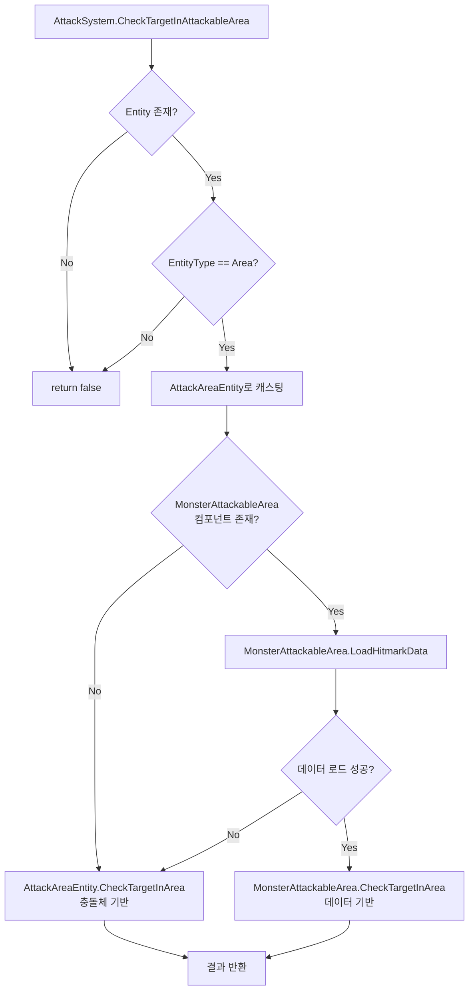

# MonsterAttackableArea 통합 구현 계획

## 목표

`AttackAreaEntity`와 같은 GameObject에 `MonsterAttackableArea` 컴포넌트가 있을 때, `AttackSystem.CheckTargetInAttackableArea()`에서 `MonsterAttackableArea.CheckTargetInArea()`를 우선적으로 사용하도록 수정합니다.

## 현재 구조 분석

### 현재 흐름

```
AttackSystem.CheckTargetInAttackableArea(hitmarkName)
    ↓
AttackAreaEntity.CheckTargetInArea()
    ↓
충돌체 기반 영역 체크 (Collider2D의 실제 크기 사용)
```

### 목표 흐름

```
AttackSystem.CheckTargetInAttackableArea(hitmarkName)
    ↓
MonsterAttackableArea가 있으면?
    ├─ Yes → MonsterAttackableArea.CheckTargetInArea() (데이터 기반)
    └─ No  → AttackAreaEntity.CheckTargetInArea() (충돌체 기반)
```

## 구현 작업

### 1. AttackSystem.CheckTargetInAttackableArea() 수정

**파일**: `Assets/Scripts/Runtime/Combat/Attack/AttackSystem.cs`

**변경 내용**:

- `AttackEntityTypes.Area`인 경우, `AttackAreaEntity`에서 `MonsterAttackableArea` 컴포넌트를 찾습니다
- `MonsterAttackableArea`가 있고 `LoadHitmarkData()`가 성공하면, `MonsterAttackableArea.CheckTargetInArea()`를 호출합니다
- 없으면 기존처럼 `AttackAreaEntity.CheckTargetInArea()`를 호출합니다

**수정할 메서드**: `CheckTargetInAttackableArea()` (213-231줄)

```csharp
public virtual bool CheckTargetInAttackableArea(HitmarkNames hitmarkName)
{
    if (!ContainEntity(hitmarkName))
    {
        return false;
    }

    AttackEntity entity = FindEntity(hitmarkName);
    if (entity != null)
    {
        if (entity.EntityType == AttackEntityTypes.Area)
        {
            AttackAreaEntity areaEntity = entity as AttackAreaEntity;
            
            // MonsterAttackableArea 컴포넌트 확인
            MonsterAttackableArea monsterArea = areaEntity.GetComponent<MonsterAttackableArea>();
            if (monsterArea != null && monsterArea.LoadHitmarkData())
            {
                return monsterArea.CheckTargetInArea();
            }
            
            // 기본 충돌체 기반 체크
            return areaEntity.CheckTargetInArea();
        }
    }

    return false;
}
```

### 2. MonsterAttackableArea 초기화 확인

**파일**: `MonsterAttackableArea` 클래스 (사용자가 제공한 코드 기준)

**확인 사항**:

- `LoadHitmarkData()`가 올바르게 `HitmarkAssetData`를 로드하는지 확인
- `Owner`와 `Parent`가 올바르게 설정되는지 확인
- `CheckTargetInArea()`가 `data`가 null이 아닐 때만 동작하는지 확인

**주의사항**:

- `MonsterAttackableArea`의 `AutoGetComponents()`에서 `Owner`와 `Parent`를 설정하므로, 초기화 순서가 중요합니다
- `AttackSystem.RegisterAll()`에서 `AttackEntity.Initialization()`을 호출하므로, `MonsterAttackableArea`도 이 시점에 초기화되어야 합니다

## 데이터 흐름



## 테스트 시나리오

1. **MonsterAttackableArea 없는 경우**: 기존 동작 유지 (충돌체 기반)
2. **MonsterAttackableArea 있는 경우**: 데이터 기반 영역 체크 사용
3. **LoadHitmarkData 실패**: 충돌체 기반으로 폴백

## 주의사항

1. **초기화 순서**: `MonsterAttackableArea`의 `Owner`와 `Parent`가 올바르게 설정되어야 합니다
2. **데이터 일관성**: `HitmarkAssetData`의 `AttackableBoxSize`/`AttackableCircleSize`가 올바르게 설정되어야 합니다
3. **성능**: 매번 `GetComponent<MonsterAttackableArea>()`를 호출하므로, 필요시 캐싱을 고려할 수 있습니다 (현재는 간단한 구현 우선)

## 다음 단계 (향후)

- 각도 체크 기능 추가 (`CheckAttackableAngle()` 통합)
- 성능 최적화 (컴포넌트 캐싱)