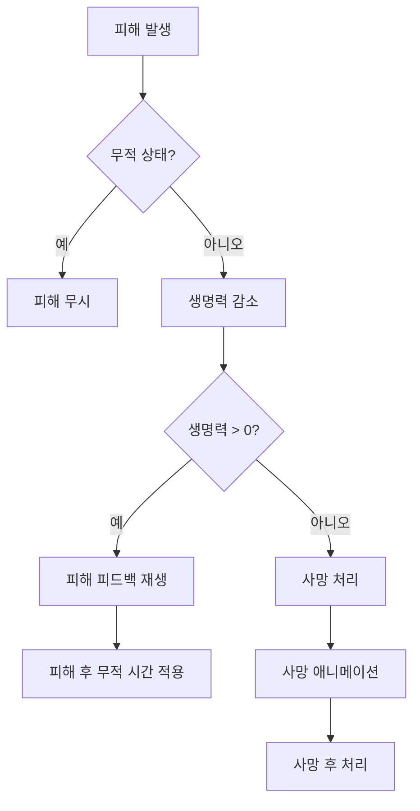
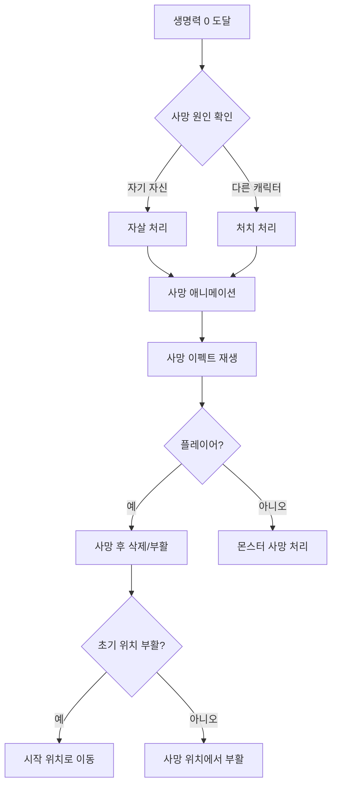

# 생명력 시스템 (Life)

## 개요

생명력은 캐릭터의 생존을 나타내는 가장 핵심적인 자원입니다. 생명력이 0이 되면 캐릭터는 사망하며, 게임 오버나 특수 처리가 발생합니다.

## 기본 개념

### 생명력의 역할
- 캐릭터의 생존 상태를 나타냄
- 피해를 받으면 감소
- 0이 되면 사망 처리
- 회복하여 생존 시간 연장

### 수치 체계
- **Current**: 현재 생명력
- **Max**: 최대 생명력
- **Rate**: Current / Max 비율 (생명력이 얼마나 남았는지)

## 피해 받기 메커니즘

### 기본 피해 처리
1. 캐릭터가 피해를 받으면 생명력이 감소합니다
2. 피해량만큼 Current 값이 줄어듭니다
3. Current가 0 이하가 되면 사망 처리됩니다

### 피해 처리 흐름

### 피해 타입별 처리

#### 즉시 피해 (Instant Damage)
- 공격이 명중했을 때 즉시 생명력이 감소
- 피해 이펙트와 사운드 재생
- 피해 플로팅 텍스트 표시

#### 지속 피해 (Damage Over Time)
- 시간에 걸쳐 지속적으로 생명력 감소
- 플레이어의 경우 생명력을 1까지만 감소 (즉사 방지)
- 몬스터는 일반 피해와 동일하게 처리

## 회복 시스템

### 회복 방법
1. **회복 아이템 사용**: 일정량의 생명력 회복
2. **회복 스킬 사용**: 스킬로 생명력 회복
3. **자동 회복**: 특정 조건에서 자동으로 회복

### 회복 규칙
- Current가 Max를 초과할 수 없음
- Current가 0일 때는 회복 불가 (사망 상태)
- 회복량은 최대 생명력까지 제한됨

### 회복 피드백
- 회복 플로팅 텍스트 표시
- 회복 이펙트 재생
- UI 업데이트

## 무적 상태 시스템

생명력 시스템에는 여러 종류의 무적 상태가 있습니다.

### 무적 상태 종류

#### 1. 일시적 무적 (Temporarily Invulnerable)
- 특정 컴포넌트나 스킬에 의해 부여되는 무적 상태
- 여러 소스가 동시에 무적을 부여할 수 있음
- 모든 소스가 해제되어야 무적이 풀림

**예시:**
- 스킬 사용 중 무적
- 특정 애니메이션 재생 중 무적
- 버프 효과로 인한 무적

#### 2. 피해 후 무적 (Post Damage Invulnerable)
- 피해를 받은 후 일정 시간 동안 무적 상태
- 기본값: 0.5초
- 설정 가능한 지속 시간

**목적:**
- 연속 피해 방지
- 플레이어가 반응할 시간 제공

#### 3. 영구 무적 (Invulnerable)
- 항상 피해를 받지 않는 상태
- 특수 상황이나 디버그용으로 사용

#### 4. 피해 면역 (Immune To Damage)
- 모든 피해를 무시하는 상태
- 영구 무적과 유사하지만 별도 플래그

### 무적 상태 확인 순서
1. 일시적 무적 목록 확인
2. 영구 무적 플래그 확인
3. 피해 면역 플래그 확인
4. 피해 후 무적 상태 확인

**하나라도 해당되면 피해를 받지 않습니다.**

## 사망 처리

### 사망 조건
- Current가 0 이하가 되면 사망 처리

### 사망 처리 흐름

### 사망 처리 옵션

#### 플레이어 사망 시
1. **사망 후 개체 삭제**: 사망 시 오브젝트 삭제 여부
2. **삭제 지연 시간**: 사망 후 삭제까지의 대기 시간 (기본 5초)
3. **충돌 무시**: 사망 후 충돌체 비활성화 여부
4. **중력 무시**: 사망 후 중력 비활성화 여부
5. **초기 위치 부활**: 사망 위치 vs 시작 위치에서 부활

#### 몬스터 사망 시
- 일반적으로 사망 애니메이션 후 삭제
- 처치 통계 기록
- 보상 지급

### 특수 사망 케이스

#### 자살 (Suicide)
- 캐릭터가 자신에게 피해를 입혀 사망
- 자살 이펙트 재생
- 특수 처리 가능

#### 처치 (Killed)
- 다른 캐릭터에 의해 사망
- 처치자 정보 기록
- 통계 업데이트

## 특수 케이스

### 치트 모드
- **죽지 않는 치트**: 생명력이 0이 되어도 1로 유지
- 디버그 및 테스트용

### 지속 피해 보호
- 플레이어가 지속 피해로 사망하는 것을 방지
- 생명력을 1까지만 감소시킴
- 즉사는 방지하지만 일반 피해는 정상 처리

### 방어 가능 상태
- **Defensible**: 방어할 수 있는 상태
- 방어 성공 시 피해를 막을 수 있음
- 방어 실패 시 정상 피해 처리

## 시각적 피드백

### 피해 시
- 피해 플로팅 텍스트 (빨간색 숫자)
- 피해 이펙트 (혈흔, 충격 등)
- 화면 흔들림 (설정 가능)
- 캐릭터 깜빡임 효과

### 회복 시
- 회복 플로팅 텍스트 (초록색 숫자)
- 회복 이펙트
- UI 업데이트

### 무적 상태
- 아웃라인 효과 (설정 가능)
- 특수 이펙트

### 사망 시
- 사망 애니메이션
- 사망 이펙트
- 화면 효과

## 게임플레이 영향

### 전략적 요소
- 생명력 관리는 게임의 핵심 전략
- 무적 시간 활용이 중요
- 회복 타이밍이 승패를 좌우

### 난이도 조절
- 피해 후 무적 시간으로 난이도 조절
- 회복 아이템 배치로 난이도 조절
- 최대 생명력으로 난이도 조절

### 플레이어 경험
- 명확한 피드백으로 상황 인지 향상
- 무적 시간으로 반응 시간 제공
- 사망 처리로 게임 오버 경험 제공

## 관련 시스템

- [보호막 시스템](./02_보호막_시스템.md): 피해를 먼저 흡수
- [자원 상호작용](./05_자원_상호작용.md): 다른 자원과의 관계
