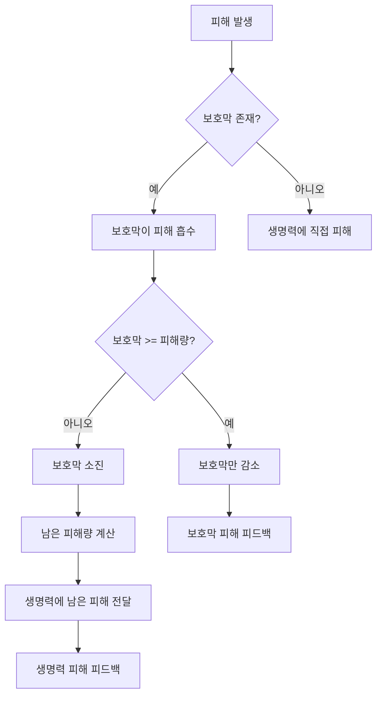

# 보호막 시스템 (Barrier)

## 개요

보호막은 생명력을 보호하는 추가 방어 자원입니다. 피해를 먼저 흡수하여 생명력이 감소하는 것을 방지합니다.

## 기본 개념

### 보호막의 역할
- 생명력을 보호하는 추가 방어막
- 피해를 먼저 흡수
- 보호막이 모두 소진되면 생명력에 피해 전달
- 충전하여 획득 가능

### 수치 체계
- **Current**: 현재 보호막 양
- **Max**: 최대 보호막 양
- **Rate**: Current / Max 비율

## 보호막 획득

### 충전 방법
1. **충전 스킬 사용**: 특정 스킬로 보호막 충전
2. **충전 아이템 사용**: 아이템으로 보호막 획득
3. **특수 조건 충전**: 특정 조건 달성 시 자동 충전

### 충전 규칙
- Current가 Max를 초과할 수 없음
- 충전량은 최대 보호막까지 제한됨
- 초기 상태는 보통 0 (설정에 따라 다를 수 있음)

### 충전 피드백
- 충전 플로팅 텍스트 표시
- 보호막 활성화 이펙트 재생
- UI 업데이트

## 피해 흡수 메커니즘

### 피해 처리 우선순위

### 보호막 피해 흡수 예시

#### 예시 1: 보호막이 충분한 경우
- 보호막: 50
- 피해량: 30
- 결과: 보호막 20 남음, 생명력 피해 없음

#### 예시 2: 보호막이 부족한 경우
- 보호막: 20
- 피해량: 50
- 결과: 보호막 0, 생명력 피해 30

#### 예시 3: 보호막이 없는 경우
- 보호막: 0
- 피해량: 30
- 결과: 생명력 직접 피해 30

## 보호막 소모

### 소모 조건
- 피해를 받을 때 보호막이 먼저 감소
- 보호막이 0이 되면 파괴 처리

### 보호막 파괴
- 보호막이 0이 되면 파괴 이펙트 재생
- 보호막 파괴 피드백 표시
- 이후 피해는 생명력에 직접 전달

## 보호막 상태

### 활성 상태
- Current > 0
- 피해를 흡수할 수 있음
- 보호막 이펙트 표시

### 비활성 상태
- Current = 0
- 피해를 흡수할 수 없음
- 보호막 이펙트 숨김

## 시각적 피드백

### 보호막 활성화
- 보호막 활성화 이펙트
- UI에 보호막 게이지 표시
- 캐릭터 주변 보호막 효과

### 보호막 피해
- 보호막 피해 이펙트
- 보호막 피해 플로팅 텍스트
- 보호막 게이지 감소 애니메이션

### 보호막 파괴
- 보호막 파괴 이펙트
- 보호막 파괴 사운드
- 보호막 게이지 사라짐

### 보호막 충전
- 충전 이펙트
- 충전 플로팅 텍스트
- 보호막 게이지 증가 애니메이션

## 게임플레이 영향

### 전략적 요소
- 보호막은 생명력을 보호하는 중요한 자원
- 보호막 충전 타이밍이 중요
- 보호막이 있을 때 공격적으로 플레이 가능

### 난이도 조절
- 보호막 최대량으로 난이도 조절
- 보호막 충전 빈도로 난이도 조절
- 보호막 효과로 플레이어 안전성 제공

### 플레이어 경험
- 보호막이 있으면 안전감 제공
- 보호막 파괴 시 긴장감 증가
- 보호막 관리가 전략적 깊이 추가

## 보호막 vs 생명력

### 차이점

| 항목 | 보호막 | 생명력 |
|------|--------|--------|
| 피해 흡수 | 먼저 흡수 | 보호막 후 흡수 |
| 획득 방법 | 충전 | 회복 |
| 소진 시 | 파괴 이펙트 | 사망 처리 |
| 초기값 | 보통 0 | 최대값 |

### 상호작용
- 보호막이 있으면 생명력이 보호됨
- 보호막이 없으면 생명력에 직접 피해
- 둘 다 관리해야 생존 가능

## 관련 시스템

- [생명력 시스템](./01_생명력_시스템.md): 보호막 후 피해 전달
- [자원 상호작용](./05_자원_상호작용.md): 다른 자원과의 관계
