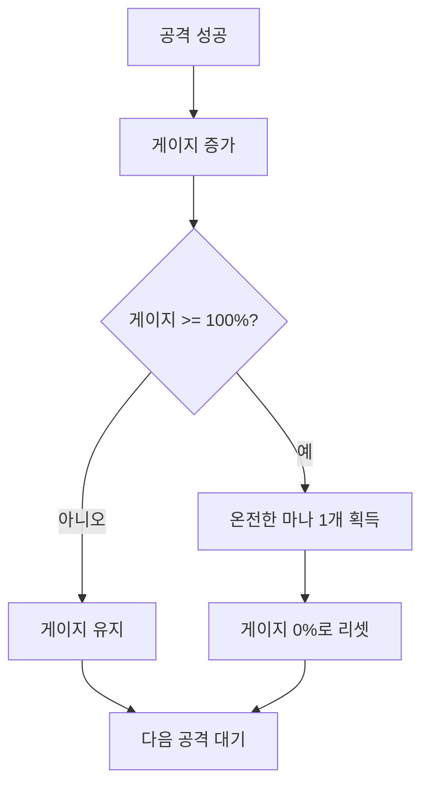

# 마나 시스템 (Mana)

## 개요

마나는 스킬이나 특수 공격을 사용하기 위한 자원입니다. 게이지 기반 획득 시스템을 사용하여, 공격 성공 시 게이지가 증가하고 게이지가 100%가 되면 온전한 마나를 획득합니다.

## 기본 개념

### 마나의 역할
- 스킬 사용을 위한 자원
- 공격 성공으로 획득
- 온전한 마나 단위로만 사용 가능
- 전투 중 지속적으로 관리 필요

### 수치 체계
- **Current**: 현재 보유한 온전한 마나 개수
- **Max**: 최대 보유 가능한 온전한 마나 개수
- **GaugeProgress**: 게이지 진행도 (0.0 ~ 1.0)
- **FullManaCount**: Current와 동일 (온전한 마나 개수)

## 게이지 기반 획득 시스템

### 게이지 시스템 개요
마나는 일반적인 자원과 달리 **게이지 기반 획득 시스템**을 사용합니다.

### 게이지 진행도
- **0.0 ~ 1.0 사이의 값**
- 1.0 (100%)가 되면 온전한 마나 1개 획득
- 온전한 마나 획득 후 0.0으로 리셋

### 게이지 증가 방법

#### 공격 성공 시
- 공격이 성공하면 게이지가 증가
- 증가량은 공격 타입이나 설정에 따라 다름
- 여러 공격으로 게이지를 쌓아 올릴 수 있음

**예시:**
- 기본 공격 성공: 게이지 +0.2 (20%)
- 강공격 성공: 게이지 +0.3 (30%)
- 콤보 공격 성공: 게이지 +0.5 (50%)

### 온전한 마나 획득
- 게이지가 1.0 (100%)에 도달하면 자동으로 온전한 마나 1개 획득
- 게이지는 0.0으로 리셋
- 최대 마나 개수에 도달하면 추가 획득 불가

## 마나 사용

### 사용 조건
- 온전한 마나가 1개 이상 있어야 사용 가능
- 스킬마다 필요한 마나 개수가 다를 수 있음

### 사용 방식
- 스킬 사용 시 온전한 마나를 단위로 소모
- 마나가 부족하면 스킬 사용 불가
- 마나 소모 후 게이지는 그대로 유지

### 사용 예시

#### 예시 1: 마나 1개 사용 스킬
- 현재 마나: 3개
- 스킬 사용: 마나 1개 소모
- 결과: 마나 2개 남음

#### 예시 2: 마나 2개 사용 스킬
- 현재 마나: 3개
- 스킬 사용: 마나 2개 소모
- 결과: 마나 1개 남음

#### 예시 3: 마나 부족
- 현재 마나: 1개
- 필요 마나: 2개
- 결과: 스킬 사용 불가

## 마나 관리 전략

### 게이지 관리
- 게이지를 효율적으로 쌓아 올리는 것이 중요
- 게이지가 거의 찼을 때 공격하면 빠르게 마나 획득
- 게이지를 낭비하지 않도록 주의

### 마나 보존
- 마나를 아껴서 중요한 순간에 사용
- 마나가 부족하면 게이지를 다시 쌓아야 함
- 마나 사용 타이밍이 중요

### 마나 최대치 관리
- 최대 마나 개수는 능력치에 따라 결정
- 최대치가 높을수록 더 많은 스킬 사용 가능
- 최대치에 도달하면 추가 획득 불가

## 초기화 및 리셋

### 전투 시작 시
- 최대 마나 개수로 초기화
- 게이지 진행도 0%로 시작
- 전투 중 지속적으로 관리

### 마나 리셋
- 특정 조건에서 마나가 리셋될 수 있음
- 게이지 진행도도 함께 리셋

## 시각적 피드백

### 게이지 표시
- UI에 게이지 진행도 표시
- 게이지가 증가할 때 애니메이션
- 게이지가 100%에 도달하면 특수 효과

### 마나 획득
- 온전한 마나 획득 시 이펙트
- 마나 개수 UI 업데이트
- 획득 사운드

### 마나 사용
- 마나 사용 시 이펙트
- 마나 개수 UI 감소
- 사용 사운드

### 마나 부족
- 마나 부족 시 경고 표시
- 스킬 사용 불가 표시
- 게이지 필요 표시

## 게임플레이 영향

### 전략적 요소
- 마나 관리는 전투의 핵심 전략
- 게이지를 효율적으로 쌓는 것이 중요
- 마나 사용 타이밍이 승패를 좌우

### 리소스 관리
- 마나를 아껴서 중요한 순간에 사용
- 게이지를 빠르게 쌓아 마나 획득
- 마나 부족 시 전략 변경 필요

### 플레이어 경험
- 게이지 시스템으로 지속적인 진행감 제공
- 마나 획득의 만족감
- 마나 관리의 전략적 깊이

## 마나 vs 다른 자원

### 생명력과의 차이
- 생명력: 피해를 받으면 감소, 회복으로 증가
- 마나: 공격 성공으로 획득, 스킬 사용으로 소모

### 패링 게이지와의 유사점
- 둘 다 게이지 기반 획득 시스템 사용
- 공격 성공으로 게이지 증가
- 온전한 단위로 사용

### 차이점
- 마나: 스킬 사용용, 번아웃 없음
- 패링 게이지: 패링/대시용, 번아웃 있음

## 관련 시스템

- [패링 게이지 시스템](./04_패링게이지_시스템.md): 유사한 게이지 시스템
- [자원 상호작용](./05_자원_상호작용.md): 다른 자원과의 관계
