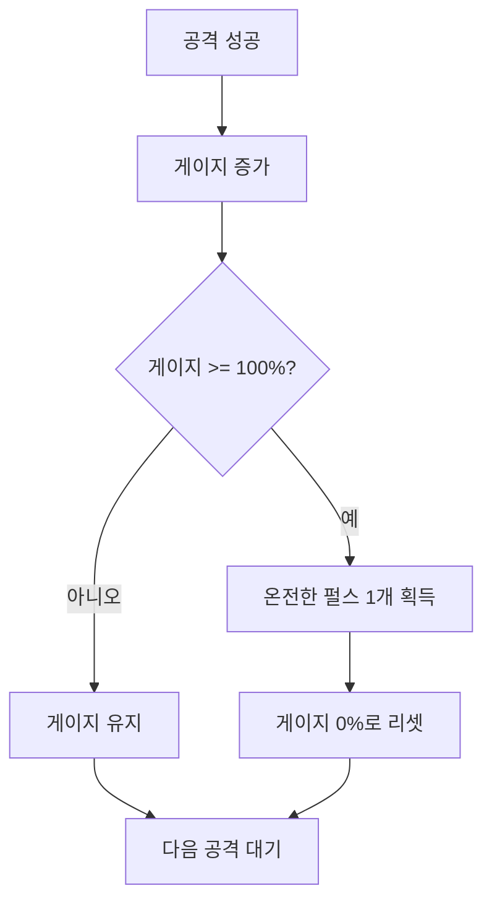
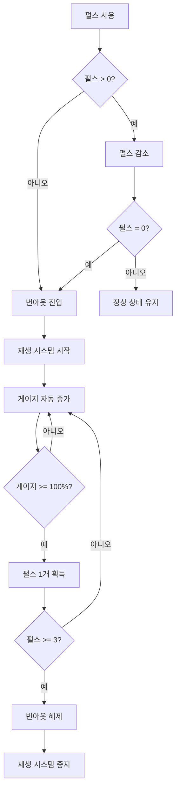

# 패링 게이지 시스템 (Pulse)

## 개요

패링 게이지는 패링이나 대시 같은 특수 행동을 위한 자원입니다. 마나와 유사하게 게이지 기반 획득 시스템을 사용하지만, 모두 소진되면 번아웃 상태에 진입하고 자동 재생 시스템이 작동합니다.

## 기본 개념

### 패링 게이지의 역할
- 패링 사용을 위한 자원
- 대시 사용을 위한 자원
- 공격 성공으로 획득
- 온전한 펄스 단위로만 사용 가능
- 번아웃 시스템으로 리스크 관리

### 수치 체계
- **Current**: 현재 보유한 온전한 펄스 개수
- **Max**: 최대 보유 가능한 온전한 펄스 개수
- **GaugeProgress**: 게이지 진행도 (0.0 ~ 1.0)
- **RegenerateRate**: 재생 비율 (번아웃 시 자동 회복 속도)

## 게이지 기반 획득 시스템

### 게이지 시스템 개요
패링 게이지는 마나와 동일한 **게이지 기반 획득 시스템**을 사용합니다.

### 게이지 진행도
- **0.0 ~ 1.0 사이의 값**
- 1.0 (100%)가 되면 온전한 펄스 1개 획득
- 온전한 펄스 획득 후 0.0으로 리셋

### 게이지 증가 방법

#### 공격 성공 시
- 공격이 성공하면 게이지가 증가
- 증가량은 공격 타입이나 설정에 따라 다름
- 여러 공격으로 게이지를 쌓아 올릴 수 있음

#### 패링 성공 시
- 패링 성공 시 온전한 펄스 1개 즉시 획득
- 게이지를 거치지 않고 바로 획득
- 패링의 보상 메커니즘

### 온전한 펄스 획득
- 게이지가 1.0 (100%)에 도달하면 자동으로 온전한 펄스 1개 획득
- 게이지는 0.0으로 리셋
- 최대 펄스 개수에 도달하면 추가 획득 불가

## 펄스 사용

### 사용 조건
- 온전한 펄스가 1개 이상 있어야 사용 가능
- 번아웃 상태가 아니어야 사용 가능
- **CanUsePulse**: Current >= 1 && !IsBurnout

### 사용 방식
- 패링/대시 사용 시 온전한 펄스 1개씩 소모
- 펄스가 부족하면 사용 불가
- 펄스 소모 후 게이지는 그대로 유지

### 사용 예시

#### 예시 1: 패링 사용
- 현재 펄스: 3개
- 패링 사용: 펄스 1개 소모
- 결과: 펄스 2개 남음

#### 예시 2: 대시 사용
- 현재 펄스: 2개
- 대시 사용: 펄스 1개 소모
- 결과: 펄스 1개 남음

#### 예시 3: 펄스 부족
- 현재 펄스: 0개
- 패링 시도: 사용 불가
- 결과: 번아웃 상태 (재생 대기)

## 번아웃 시스템

### 번아웃이란?
패링 게이지가 모두 소진되면 **번아웃 상태**에 진입합니다. 번아웃 상태에서는 패링이나 대시를 사용할 수 없고, 자동 재생 시스템이 작동합니다.

### 번아웃 진입 조건
- Current가 0이 되면 자동으로 번아웃 상태 진입
- 번아웃 상태에서는 패링/대시 사용 불가

### 번아웃 해제 조건
- Current가 3 이상이 되면 번아웃 상태 해제
- 번아웃 해제 후 정상적으로 패링/대시 사용 가능
- 재생 시스템 자동 중지

### 번아웃 상태 흐름

## 재생 시스템

### 재생이란?
번아웃 상태에 진입하면 자동으로 게이지가 증가하여 펄스를 회복하는 시스템입니다.

### 재생 조건
- 번아웃 상태일 때만 작동
- 캐릭터가 생존 상태여야 함
- 재생 비율이 0보다 커야 함

### 재생 메커니즘
- 매 프레임마다 게이지가 자동으로 증가
- 증가량 = RegenerateRate × Time.deltaTime
- 게이지가 100%가 되면 펄스 1개 획득
- 펄스가 3개 이상이 되면 번아웃 해제 및 재생 중지

### 재생 비율
- **RegenerateRate**: 초당 게이지 증가 비율
- 값이 클수록 빠르게 회복
- 0 이하면 재생 작동 안 함

### 재생 중지 조건
1. 번아웃 상태 해제 (펄스 >= 3)
2. 캐릭터 사망
3. 재생 비율이 0 이하로 변경
4. 바이탈 또는 소유자 없음

## 초기화 및 리셋

### 전투 시작 시
- 최대 펄스 개수로 초기화
- 게이지 진행도 0%로 시작
- 번아웃 상태 아님
- 전투 중 지속적으로 관리

### 펄스 리셋
- 특정 조건에서 펄스가 리셋될 수 있음
- 게이지 진행도도 함께 리셋
- 번아웃 상태도 해제

## 시각적 피드백

### 게이지 표시
- UI에 게이지 진행도 표시
- 게이지가 증가할 때 애니메이션
- 게이지가 100%에 도달하면 특수 효과

### 펄스 획득
- 온전한 펄스 획득 시 이펙트
- 펄스 개수 UI 업데이트
- 획득 사운드

### 펄스 사용
- 펄스 사용 시 이펙트
- 펄스 개수 UI 감소
- 사용 사운드

### 번아웃 상태
- 번아웃 상태 시 특수 UI 표시
- 번아웃 경고 효과
- 재생 중임을 표시

### 재생 중
- 재생 중 게이지 자동 증가 표시
- 재생 진행 상황 UI 표시
- 재생 완료까지 남은 시간 표시

## 게임플레이 영향

### 전략적 요소
- 펄스 관리는 전투의 핵심 전략
- 번아웃을 피하기 위해 펄스를 아껴야 함
- 번아웃 상태에서는 방어적으로 플레이 필요

### 리스크 관리
- 펄스를 모두 사용하면 번아웃 위험
- 번아웃 상태에서는 취약해짐
- 재생 시간 동안 생존해야 함

### 플레이어 경험
- 게이지 시스템으로 지속적인 진행감 제공
- 펄스 획득의 만족감
- 번아웃의 긴장감
- 재생의 기대감

## 펄스 vs 마나

### 유사점
- 둘 다 게이지 기반 획득 시스템
- 공격 성공으로 게이지 증가
- 온전한 단위로 사용

### 차이점

| 항목 | 펄스 | 마나 |
|------|------|------|
| 용도 | 패링/대시 | 스킬 |
| 번아웃 | 있음 | 없음 |
| 재생 | 자동 재생 | 없음 |
| 패링 보상 | 패링 성공 시 즉시 획득 | 없음 |

## 관련 시스템

- [마나 시스템](./03_마나_시스템.md): 유사한 게이지 시스템
- [자원 상호작용](./05_자원_상호작용.md): 다른 자원과의 관계
