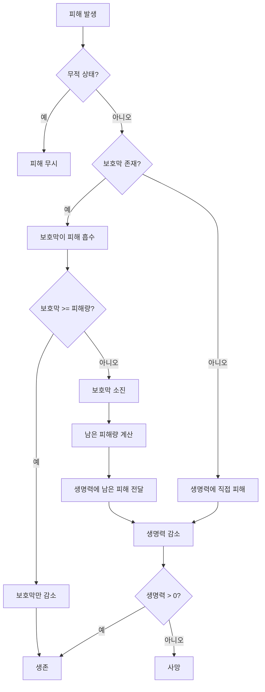
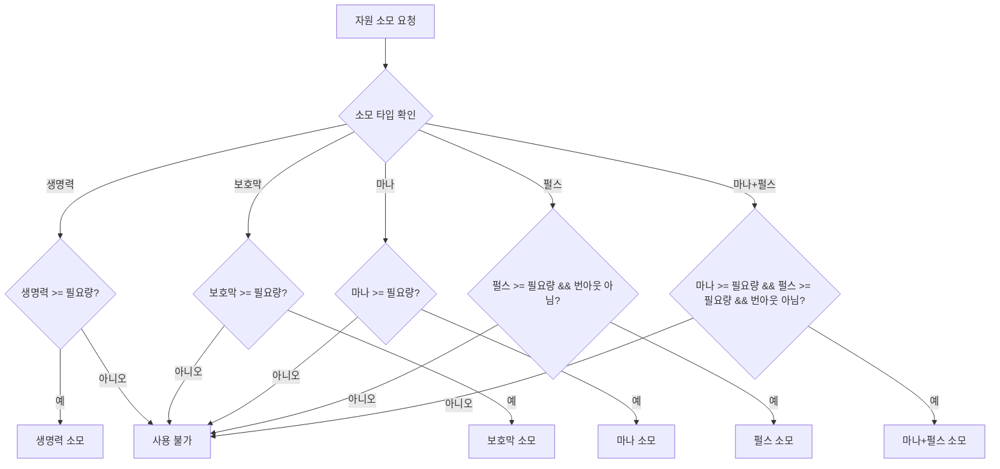

# 자원 상호작용

## 개요

캐릭터의 4가지 자원(생명력, 보호막, 마나, 패링 게이지)은 서로 독립적으로 작동하지만, 전투 상황에서 상호작용하며 복합적인 전략을 만들어냅니다.

## 피해 처리 우선순위

### 피해 처리 흐름

### 우선순위 규칙

1. **무적 상태 확인** (최우선)
   - 무적 상태면 모든 피해 무시
   - 무적 상태가 아니면 다음 단계로

2. **보호막 확인**
   - 보호막이 있으면 먼저 피해 흡수
   - 보호막이 없으면 생명력에 직접 피해

3. **보호막 피해 흡수**
   - 보호막이 피해량보다 크거나 같으면 보호막만 감소
   - 보호막이 피해량보다 작으면 보호막 소진 후 남은 피해를 생명력에 전달

4. **생명력 피해**
   - 보호막 후 남은 피해 또는 직접 피해를 생명력에 적용
   - 생명력이 0 이하가 되면 사망 처리

### 피해 처리 예시

#### 예시 1: 보호막이 충분한 경우
- 보호막: 50, 생명력: 100
- 피해량: 30
- 결과: 보호막 20, 생명력 100 (피해 없음)

#### 예시 2: 보호막이 부족한 경우
- 보호막: 20, 생명력: 100
- 피해량: 50
- 결과: 보호막 0, 생명력 70 (30 피해)

#### 예시 3: 보호막이 없는 경우
- 보호막: 0, 생명력: 100
- 피해량: 30
- 결과: 보호막 0, 생명력 70 (30 피해)

#### 예시 4: 무적 상태
- 무적 상태: 활성
- 피해량: 100
- 결과: 모든 피해 무시

## 자원 소모 우선순위

### 전투 자원 사용 시나리오

전투 중 특정 행동(스킬 사용 등)이 여러 자원을 동시에 소모할 수 있습니다.

### 자원 소모 타입

#### 1. 생명력 소모 (FixedLife)
- 생명력을 소모하는 행동
- 예: 생명력을 대가로 하는 강력한 스킬
- 생명력이 부족하면 사용 불가

#### 2. 보호막 소모 (FixedBarrier)
- 보호막을 소모하는 행동
- 예: 보호막을 대가로 하는 방어 스킬
- 보호막이 부족하면 사용 불가

#### 3. 마나 소모 (FixedResource)
- 마나를 소모하는 행동
- 예: 스킬 사용
- 마나가 부족하면 사용 불가

#### 4. 펄스 소모 (FixedPulse)
- 펄스를 소모하는 행동
- 예: 패링, 대시
- 펄스가 부족하거나 번아웃 상태면 사용 불가

#### 5. 마나 + 펄스 동시 소모 (FixedResourceAndPulse)
- 마나와 펄스를 동시에 소모하는 행동
- 예: 특수 스킬
- 둘 다 있어야 사용 가능 (하나라도 부족하면 사용 불가)

### 자원 소모 처리 규칙

### 동시 소모 처리
- 마나와 펄스를 동시에 소모하는 경우, 둘 다 충분해야 사용 가능
- 하나라도 부족하면 사용 불가
- 사용 시 둘 다 동시에 소모

## 자원 획득 상호작용

### 공격 성공 시 획득

#### 마나와 펄스 동시 획득
- 공격 성공 시 마나 게이지와 펄스 게이지가 동시에 증가할 수 있음
- 각각 독립적으로 게이지 증가
- 각각 100%가 되면 각각 획득

#### 획득 우선순위
- 마나와 펄스는 독립적으로 획득
- 서로 영향을 주지 않음
- 동시에 획득 가능

### 회복 및 충전

#### 생명력 회복
- 보호막과 독립적으로 회복
- 보호막이 있어도 생명력 회복 가능
- 생명력 회복은 보호막에 영향 없음

#### 보호막 충전
- 생명력과 독립적으로 충전
- 생명력이 있어도 보호막 충전 가능
- 보호막 충전은 생명력에 영향 없음

## 전투 시나리오

### 시나리오 1: 방어 중심 플레이
- 보호막을 충전하여 생명력 보호
- 보호막이 있을 때 공격적으로 플레이
- 보호막 소진 시 방어적으로 전환

### 시나리오 2: 공격 중심 플레이
- 마나를 모아 강력한 스킬 사용
- 펄스를 사용하여 패링으로 안전 확보
- 생명력 관리를 통한 생존

### 시나리오 3: 밸런스 플레이
- 보호막으로 생명력 보호
- 마나로 스킬 사용
- 펄스로 패링/대시 사용
- 모든 자원을 균형있게 관리

### 시나리오 4: 리스크 플레이
- 펄스를 모두 사용하여 공격적 플레이
- 번아웃 상태에서 생존하며 재생 대기
- 마나를 모아 강력한 스킬로 역전

## 자원 관리 전략

### 생존 우선 전략
1. 보호막을 우선 충전
2. 생명력을 안전하게 유지
3. 마나와 펄스를 보조적으로 사용

### 공격 우선 전략
1. 마나를 모아 강력한 스킬 사용
2. 펄스를 사용하여 공격 기회 확보
3. 보호막과 생명력은 최소한만 유지

### 밸런스 전략
1. 모든 자원을 균형있게 관리
2. 상황에 따라 우선순위 변경
3. 유연한 전략 전환

## 자원 간 의존성

### 독립적인 자원
- 생명력, 보호막, 마나, 펄스는 기본적으로 독립적
- 각각 독립적으로 획득/소모
- 서로 직접적인 영향을 주지 않음

### 간접적 상호작용
- 보호막이 생명력을 보호 (피해 흡수)
- 마나와 펄스는 공격 성공으로 동시 획득 가능
- 모든 자원이 전투 결과에 영향을 줌

### 전략적 상호작용
- 자원 관리가 전투 전략에 영향
- 자원 조합이 다양한 전략 생성
- 자원 밸런스가 게임플레이 깊이 제공

## 관련 문서

- [캐릭터 자원 시스템 개요](./캐릭터_자원_시스템_개요.md): 전체 시스템 개요
- [생명력 시스템](./01_생명력_시스템.md): 생명력 상세
- [보호막 시스템](./02_보호막_시스템.md): 보호막 상세
- [마나 시스템](./03_마나_시스템.md): 마나 상세
- [패링 게이지 시스템](./04_패링게이지_시스템.md): 패링 게이지 상세
