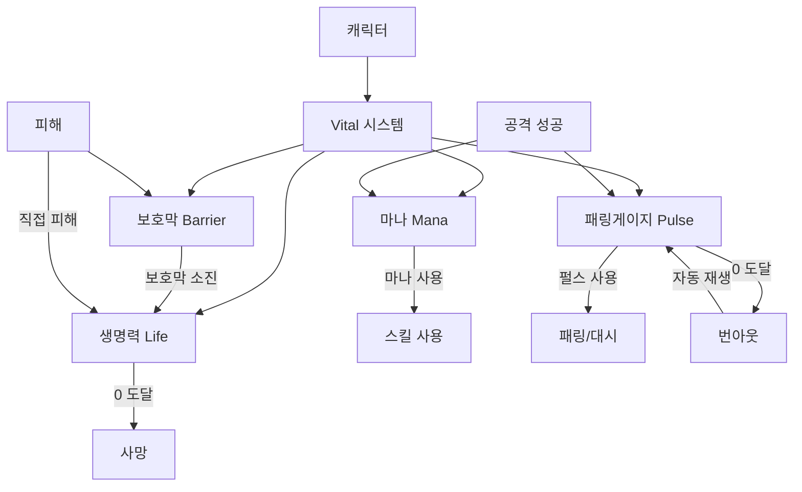

# 캐릭터 자원 시스템 개요

## 시스템 소개

캐릭터 자원 시스템은 게임 내 캐릭터가 보유하고 관리하는 4가지 핵심 자원을 관리합니다. 각 자원은 캐릭터의 생존, 전투 능력, 특수 행동을 제어하는 역할을 합니다.

## 자원 타입

### 1. 생명력 (Life)
캐릭터의 생존을 나타내는 가장 기본적인 자원입니다. 생명력이 0이 되면 캐릭터는 사망합니다.

**주요 특징:**
- 피해를 받으면 감소
- 회복 아이템이나 스킬로 회복 가능
- 무적 상태로 피해를 막을 수 있음
- 사망 시 특수 처리 (부활, 삭제 등)

### 2. 보호막 (Barrier)
생명력을 보호하는 추가 방어 자원입니다. 피해를 먼저 흡수하여 생명력을 보호합니다.

**주요 특징:**
- 피해를 먼저 흡수
- 충전하여 획득
- 보호막이 모두 소진되면 생명력에 피해가 전달됨

### 3. 마나 (Mana)
스킬이나 특수 공격을 사용하기 위한 자원입니다.

**주요 특징:**
- 게이지 기반 획득 시스템
- 공격 성공 시 게이지 증가
- 게이지가 100%가 되면 온전한 마나 1개 획득
- 온전한 마나 단위로만 사용 가능

### 4. 패링 게이지 (Pulse)
패링이나 대시 같은 특수 행동을 위한 자원입니다.

**주요 특징:**
- 게이지 기반 획득 시스템
- 공격 성공 시 게이지 증가
- 게이지가 100%가 되면 온전한 펄스 1개 획득
- 모두 소진 시 번아웃 상태 진입
- 번아웃 상태에서는 자동 재생

## 자원 간 관계도

## 자원 관리 기본 원리

### 수치 체계
모든 자원은 다음 두 가지 수치를 가집니다:
- **Current (현재 값)**: 현재 보유한 자원의 양
- **Max (최대 값)**: 보유할 수 있는 최대 자원의 양

### 자원 획득 방식
1. **생명력**: 회복 아이템, 스킬로 회복
2. **보호막**: 충전 스킬이나 아이템으로 획득
3. **마나**: 공격 성공 시 게이지 증가 → 온전한 마나 획득
4. **패링 게이지**: 공격 성공 시 게이지 증가 → 온전한 펄스 획득

### 자원 소모 방식
1. **생명력**: 피해를 받을 때 감소
2. **보호막**: 피해를 흡수할 때 감소
3. **마나**: 스킬 사용 시 온전한 마나 단위로 소모
4. **패링 게이지**: 패링/대시 사용 시 온전한 펄스 단위로 소모

## 용어 정리

| 용어 | 설명 |
|------|------|
| **Vital** | 캐릭터의 모든 자원을 관리하는 시스템 |
| **Current** | 현재 보유한 자원의 양 |
| **Max** | 보유할 수 있는 최대 자원의 양 |
| **Rate** | Current / Max 비율 (0.0 ~ 1.0) |
| **온전한 마나/펄스** | 게이지가 100%가 되어 획득한 완전한 단위 |
| **게이지 진행도** | 0.0 ~ 1.0 사이의 값으로, 1.0이 되면 온전한 단위 획득 |
| **무적 상태** | 피해를 받지 않는 상태 |
| **번아웃** | 패링 게이지가 모두 소진된 상태 |
| **재생** | 자동으로 자원이 회복되는 메커니즘 |

## 관련 문서

자세한 내용은 다음 문서를 참고하세요:

1. [생명력 시스템 상세](./01_생명력_시스템.md)
2. [보호막 시스템 상세](./02_보호막_시스템.md)
3. [마나 시스템 상세](./03_마나_시스템.md)
4. [패링 게이지 시스템 상세](./04_패링게이지_시스템.md)
5. [자원 상호작용 규칙](./05_자원_상호작용.md)
